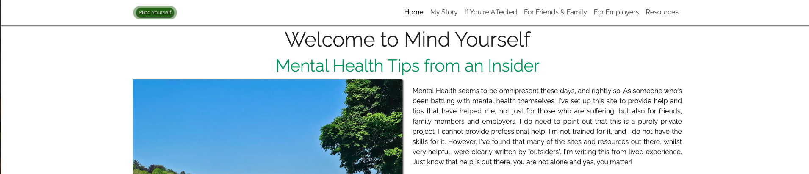
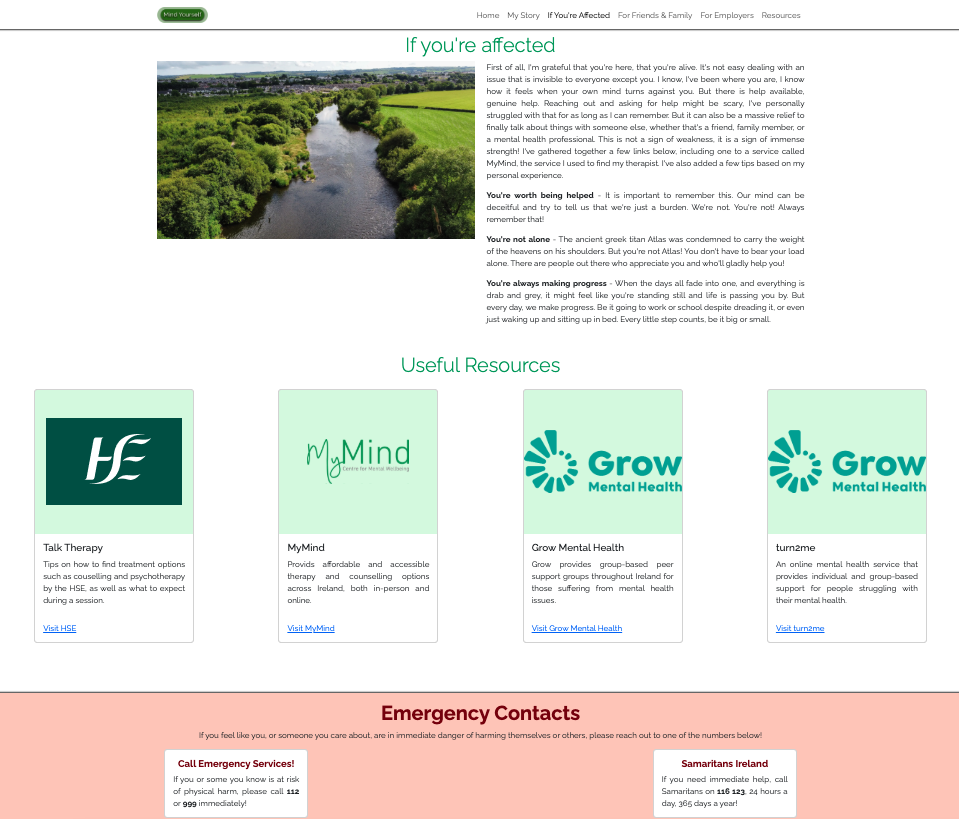
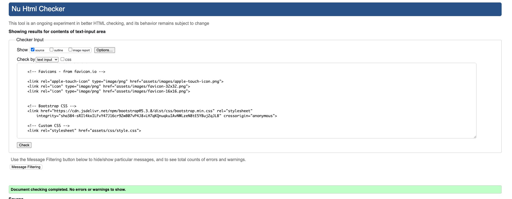
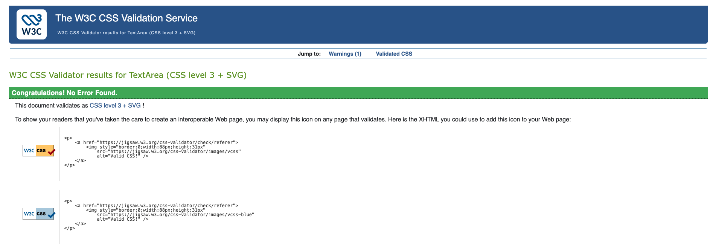
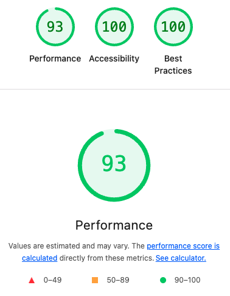

# Mind Yourself

Mind yourself is a website built to provide insight and advice to those dealing with mental health issues, their friends and family, as well as employers & managers, based on the personal experience of the author, who has had to deal with mental health issues himself.

It was created as part of Code Institute's GoStack 25 Full Stack Software Developer Bootcamp and aims to demonstrate my skills with HTML5, CSS and Bootstrap to create a fully responsive mental health focused website.

Live Site Link: [Mind Yourself](https://thomil13.github.io/project-atlas/index.html)

## Table of Content

- [Table of Content](#table-of-content)

- [Design Statement](#design-statement)

  - [Visual Design Elements](#visual-design-elements)

- [User Stories](#user-stories)

- [Features](#features)

  - [Existing Features](#existing-features)

  - [Missing Features](#features-left-to-implement)

- [Testing](#testing)

  - [Validation Testing](#validation-testing)

- [Known Bugs](#unfixed-bugs)

- [Deployment](#deployment)

- [Credits](#credits)

## Design Statement

> A designer knows he has achieved perfection not when there is nothing left to add, but when there is nothing left to take away.
- Antoine de Saint-Exupery

I was a blogger & content creator long before I even considered learning to code. As such, I approached this project with a view to making the content do as much of the talking as possible. Efforts were also taken to ensure the site aligns with my existing real-world blogs. Simplicity was the name of the game here, in order to allow the content to take center stage. White and green are the primary colors in order to create a calm atmosphere on the site, with only the emergency contact information in the footer breaking from this logic in order to convey the importance of the information there.

### Visual Design Elements

- Font: Raleway
  - Used as only font as its typography is equally suited for headings and body text
- Color Scheme
  - Primary Color: #00a160
  - Secondary Color: #4de35b
  - Highlight Color: #99e3d2

  - Emergency Contact Background Color: #facbbe
  - Emergency Contact Text Color: #7a0000

- Use of nature images to reinforce feeling of calm throughout the website

## User Stories

- User Story 1: Home Page / Introduction
  - AS A general visitor
  - I CAN get a quick overview of the purpose of the site
  - SO I can see if it is relevant to me

- User Story 2: Implement Nav Bar
  - AS A general visitor
  - I CAN switch between pages
  - SO THAT I can quickly find the content I need

- User Story 3: Implement Emergency Contact Footer
  - AS A Site Visitor
  - I CAN see Emergency points of contact
  - SO THAT I can immediately call for help if required

- User Story 4: Add Content for Affected Persons
  - AS someone affected
  - I CAN find information relevant to me
  - SO THAT I can get the assistance I need
 
- User Story 5: Implement Accessibility Features
  - AS A sight-impaired visitor
  - I CAN use screen readers & accessibility tools
  - SO THAT I can easily navigate the site

- User Story 6: Add Content for Friends/Family of Affected Persons
  - AS A friend/family member
  - I CAN find links and information relevant to me
  - SO THAT I can better help my friend/family member affected

- User Story 7: Add Content for Managers/Employers of Affected Persons
  - AS AN employer
  - I CAN find links and information specific to me
  - SO THAT I can better help an affected staff member

- User Story 8: Add Links/Resources Page
  - As a Site Visitor
  - I can see all support links in one place
  - So that I can quickly find the resources I need
    
## Features

- Fully responsive website for easy reading on mobile, tablet, laptop and desktop devices.
- Dedicated pages for patients, family & friends, and employers/managers
- Links to mental health resources

### Existing Features 

- Responsive Navbar
  - Present across all subpages
    
- Landing Page
  - Introduces the user to the page and aims to create a relaxed, calming environment
  - Contains rotating image carousel containing landscape and nature images to aid in creating a calming environment

- Page for People affected by Mental Health issues
  -  Written for people currently battling with mental health issues, basex on the author's personal experience
  -  The page is written to encourage people affected by mental health issues to reach out and seek help
  -  Page contains links to mental health resources, including myMind, a service used by the author

- Page for Friends and Family of Mental Health sufferers
  - A dedicated page for people who are dealing with a case of mental health issues amongst their friends or family
  - Contains tips on how to approach and interact with friends or loved ones who are dealing with mental health issues
  - Contains links to resources aimed at supporting carers, family or friends
 
- Page for managers or employers of mental health sufferers
  - Dedicated page for people who are dealing with mental health issues in a corporate environment
  - Contains tips on how to deal with colleagues/employees battling with issues
  - Contains links to resources on setting up a dedicated mental health strategy
 
- Footer containing emergency contact details for anyone at risk of self-harm or suicide
  - Deliberately breaks with site stile to make intent and content clear

### Features left to implement

- Contact Form for visitor submission of their experience with mental health and therapy
- Carousel to showcase inspiring visitor submissions

## Testing

- Ongoing testing of site navigation & links throughout the development progress
- Tested Functionality of final site on the following devices
  - MacBook Air running MacOS Tahoe 26.0.1 and Chrome Version 140.0.7339.214
  - iPad Air M1 running iPadOS 26 and Safari 26
  - Samsung Galaxy Z Flip 5 running Android 15/One UI 7.0 and Chrome
 
- Tests Conducted on each of the abover devices:
  - Site Navigation
  - General Appearance
  - External Link Functionality

### Validation Testing

 - HTML Validation Testing Passed without errors or messages on October 2nd, 2025 at 18:43 IST
   - Testing Conducted via Chrome Incognito Mode (Don't ask me how many revisions it took to get there!)

---

- CSS Validation Testing passed without errors on October 2nd, 2025 at 18:50 IST

---

- Lighthouse tests within Chrome returned scores of 90 or higher across all tested areas.

### Unfixed Bugs

- Movement of Nav Bar when scrolling on mobile devices

## Deployment

- Page first deployed on Github Pages on September 30th, 2025
- Current version deployed on Github Pages on October 2nd, 2025

Link to deployed site: [Mind Yourself](https://thomil13.github.io/project-atlas/index.html)

Link to repository: [Github Repository](https://github.com/thomil13/project-atlas)

## Credits

### Content

- All texts were written by the author specifically for this page
- No Generative AI of any type was usedwas used
- Font Raleway was sourced from Google Fonts

### Media

- All photos used on this page were taken by the author or from the archives of the authors' family
- Mind yourself logo was custom-built using assets from the author's brand kit

### Disclaimer

This readme, as well as the project it documents, was built using characters responsibly sourced from recycled spam emails.
